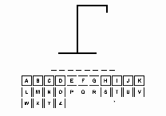
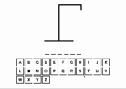

# Hangman Game

A simple hangman game built with React, TypeScript, and Vite.

## Demo

Winning the Hangman Game



Losing the Hangman Game



## Features

### Multiple keyboard input

- The game supports both physical keyboard and on screen keyboard input

### Disabling keys after it's entered, or when game ended

- When a key is entered, it will be disabled and reflects the state based on whether or not it is a correct guess.
- When the game ends, the keyboard will be disabled to prevent further input from the user.

### Randomly chosen word from a list

- The word to guess is randomly picked from a list of common words that are at least 4 letters long.

## Play it on your browser

1. Clone the repository:

   ```bash
   git clone https://github.com/your-username/hangman-game.git
   ```

2. Navigate to the project directory:

   ```bash
   cd hangman-game
   ```

3. Install dependencies:

   ```bash
   npm install
   ```

4. Start the development server:

   ```bash
   npm run dev
   ```

5. Have fun!
